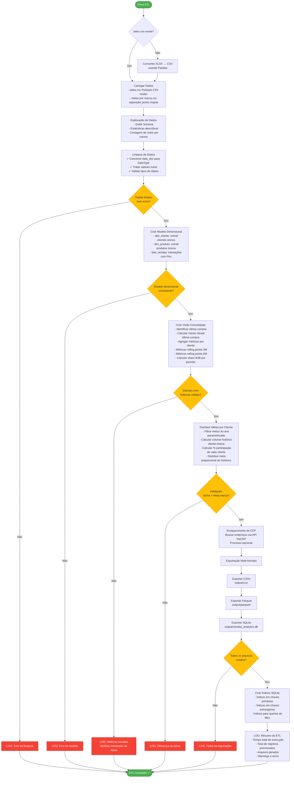

# Fluxograma do ETL - Vendas Analytics

## Legenda

### Entrada
- **sales.csv**: Arquivo de transações de vendas
- **metas por marca.csv**: Arquivo de metas por marca e ano

### Processamento
1. **Limpeza**: Conversão de tipos, tratamento de nulos, validação de dados
2. **Modelo Dimensional**: Star Schema com dimensões e fato
3. **Visão Consolidada**: Agregação de métricas por cliente com janelas temporais
4. **Distribuição de Metas**: Alocação proporcional baseada no histórico de vendas

### Saída
- **CSV**: Arquivos texto delimitados em `output/csv/`
- **Parquet**: Arquivos colunares otimizados em `output/parquet/`
- **SQLite**: Banco de dados relacional em `output/vendas_analytics.db`

### Pontos de Validação
- Dados limpos sem nulos em campos críticos
- Modelo dimensional com integridade referencial
- Métricas rolling calculadas corretamente
- Soma das metas distribuídas igual à meta da marca
- Todos os formatos de saída gerados

### Níveis de Log
- **INFO**: Progresso normal do ETL
- **WARNING**: Situações de atenção (queries vazias, valores nulos)
- **ERROR**: Falhas críticas que interrompem o processo
